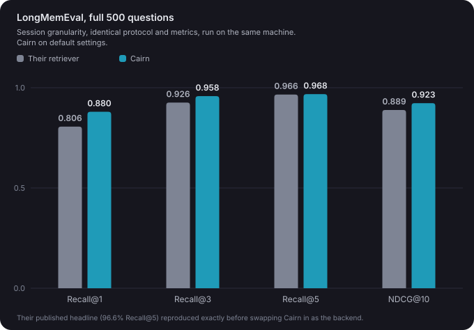
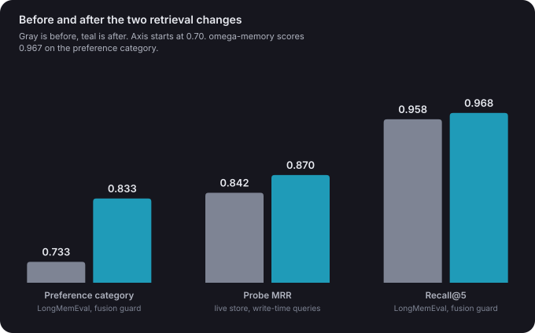

# Cairn

**Self-hosted, local-first memory for AI coding agents.** One SQLite store, shared across every repo, worktree, and session, served over MCP to Claude Code or any MCP client. Your agent's memory lives on your machine, not someone else's server.

[](https://www.python.org/downloads/)
[](LICENSE)
[]()

## What it does

- **Capture**: decisions, lessons, errors, and preferences, stored explicitly (`cairn_store`) or auto-captured by session hooks, with Jaccard dedup, Zettelkasten-style memory *evolution*, contradiction supersession, and noise blocklists.
- **Retrieve**: hybrid search fusing four channels (vector · BM25/FTS5 · temporal · entity) with canonical Reciprocal Rank Fusion, then a confidence-gated cross-encoder rerank (`ms-marco-MiniLM-L-6-v2`; measured against `bge-reranker-v2-m3`, which added zero MRR at 5-6x the latency). Embeddings are local ONNX (`gte-modernbert-base`, 768-d, CLS-pooled, cosine; chosen over bge-small, arctic-embed, and EmbeddingGemma in a full benchmark sweep).
- **Forget**: per-type exponential decay (ACT-R style, access-aware), TTLs, strength floors, and an audited `forgetting_log`. Protected types (decisions, preferences, constraints) never decay.
- **Measure**: a built-in eval harness with **non-self-referential judged probe sets**, paired A/B on any config knob, sign tests, and an MRR trend that `cairn doctor` watches for silent degradation. The current numbers are in [Benchmarks](#benchmarks).

Every scoring change in this fork was either proven equivalent or measured on judged probes before it shipped.

## How it works

### The store

Cairn is one SQLite database sitting in ~/.cairn (with sqlite-vec and FTS5
loaded), and every coding session spawns its own little MCP server that talks
to it. There is no daemon to keep alive and nothing goes to a cloud. The
embeddings are computed locally with an ONNX model (gte-modernbert-base,
768 dimensions), so the whole thing runs on your local machine. All your
sessions across all your repos and worktrees share the one store, so a
lesson learned in one project is available in the next one.

Memories are typed: decisions, lessons learned, error patterns, preferences,
task completions, session summaries. The type ends up driving most of the
behavior downstream. It decides how aggressively a memory gets deduplicated,
how much weight it carries in search, and how fast (or whether) it gets
forgotten.


### Writing a memory

A write first has to get past the noise
gates (system junk, too-short hook captures, raw JSON pretending to be a
"decision", all blocked), and then it gets compared against similar existing
memories using word-overlap similarity with per-type thresholds. If you
restate a decision you already made, Cairn doesn't store it twice, it just
bumps the original. And if the new content is similar-but-not-identical to
something already there (there's a middle band for this, loosely borrowed from
Zettelkasten note-taking), the novel sentences get appended to the existing
memory as an update instead of creating a near-duplicate. The idea is that
knowledge accretes in place rather than piling up as fifty slightly different
copies of the same fact.

Whatever survives gets embedded, auto-tagged (languages, tools, and concepts
pulled out of the text), and stored with a TTL that depends on its type. Then
in the background it gets linked to related memories, checked for
contradictions with what's already stored (the older memory gets superseded,
with an audit trail), and any stale reminders it happens to resolve get
dismissed.


### Reading

A query fans out over four channels: vector similarity, keyword search (BM25
via FTS5), temporal proximity when the query implies a time range ("last
week", "back in March"), and a match against the structured tags and entities.
The four ranked lists get fused with Reciprocal Rank Fusion. Ranks are
preferred because BM25 scores and cosine similarities live on completely
different scales, and fusing them directly is a known mess.

The fused list then gets reweighted by what Cairn knows about each memory: a
constraint outranks a session summary, memories you've rated helpful rise and
unhelpful ones sink, and old unused memories fade. After that a local
cross-encoder reranker (ms-marco-MiniLM-L-6-v2) reads the top 20 candidates
against the actual query and its favorite takes the top slot, but only when
it's confident. An indifferent reranker doesn't get to overrule the metadata
ordering (we measured this one; letting it always win looked great on one
metric and quietly made the rest of the results worse).

If nothing clears the minimum score, Cairn returns nothing. An empty result
is more useful than a plausible-looking wrong one.


### Forgetting

Memory strength decays exponentially with a per-type half-life. Session
summaries fade in a couple of weeks, task completions in about a month,
lessons hang around for months. Memories that keep getting accessed decay
slower, and some types (preferences, constraints, decisions, error patterns)
never decay at all. When something falls below the strength floor with no
access history it gets superseded, and every removal is written to a
forgetting log, so you can always go look at what was forgotten and why.


### The ambient loop

Most of the time you don't ask Cairn for anything. Session hooks do it. When
the agent edits or reads a file, relevant memories get surfaced automatically
as a short score-filtered context block (truncated previews with ids, and the
agent pulls the full memory only if it wants it). Failed commands
get captured as error patterns, decisions get captured from prompts, and each
session opens with a briefing of recent context and closes with a summary of
what got captured. The MCP tools are there for explicit store/query whenever
the agent wants them, but the hooks make the common case free.


### Measuring itself

Retrieval quality is measured and benchmarked. Cairn ships an eval harness
that builds frozen probe sets: an LLM writes realistic queries in words that
deliberately don't match the stored memory's wording, and every candidate result gets relevance-judged
0-3 to form an answer key. Evals run against a snapshot copy of the store,
never the live one, because queries bump access counts and access counts feed
decay. Any config knob can be A/B tested on the same probes with a paired
sign test, and a running MRR history feeds the doctor command so a silent
regression shows up in the numbers before you notice it behaviorally. The
current baseline on a store of about 2,300 memories is 0.888 MRR at top-5
(0.84 before the 2.1.0 tuning cycle: doc2query enrichment + the vec-top
fusion guard).

## Benchmarks

Cairn is measured with [MemPalace](https://github.com/mempalace/mempalace)'s
published LongMemEval harness. MemPalace publishes the harness and their raw
results, and `benchmarks/longmemeval_cairn.py` here is a faithful port of its
raw mode. I ran their harness on my machine and reproduced their headline
number first (96.6% Recall@5 on the full 500 questions, the same digit they
publish, re-verified against their current release on 2026-07-29). Then I
swapped Cairn in as the retrieval backend and ran the exact same protocol:
same corpus construction, same metrics, same fill rule for documents the
retriever doesn't return. omega-memory 1.5.5, the project Cairn was forked
from, runs under the same protocol via `benchmarks/longmemeval_omega.py` on
its shipped defaults. The numbers below are all three systems on that
protocol, measured on the same machine, with no LLM in any query path.

LongMemEval, full 500 questions, session granularity (each question buries
the answer in ~53 conversation sessions):



The ambient loop surfaces a small handful of memories into a working agent's
context, so what sits at rank 1 matters a lot more than what sits at rank 40.

One structural note on deeper recall: Cairn abstains. Ask it for 50 results
and it hands back the two or three it believes in, and the
benchmark's fill rule ranks everything unreturned by corpus order. I used
to think that cost real recall; measured under the current pipeline, the
entire concession is one question out of 500 at Recall@5 (0.968 strict vs
0.970 with relaxed thresholds, identical NDCG). I'll take that trade at
that price forever. An agent that gets fed a plausible-looking wrong
memory has no way to know it's wrong.

These numbers are hermetic. The harness pins off every nondeterministic
knob, makes zero network calls, and a keyless clone reproduces the same
digits run after run.

And the honest caveat, because I always leave one in: the weakest category
is still indirect preference questions like "what should I serve for dinner
with my homegrown ingredients?", where the session you need (the one where
the user talked about their garden) shares almost no wording with the
question. Cairn scored 0.733 there for a long time against MemPalace's
0.967 (omega-memory, where Cairn's pipeline started, scores 0.667 on the
same category).
Chasing it taught us more than fixing it would have: the fix wasn't the
embedder (five models all scored within one question of each other), wasn't
more semantic weighting (measurably worse), and wasn't an LLM rewriting
queries at retrieval time (indistinguishable from noise, and it made
retrieval nondeterministic, so we ripped it out). What moved it was
noticing the vector and text channels fail on *different* questions: a
one-line fusion guard that keeps the vector channel's top pick in the final
top-3 took the category to 0.833 and, because the channels disagree
everywhere, lifted every headline number above at zero cost (+10/-0 across
500 paired questions and a 113-probe live-store eval, p≈0.002). Write-time
doc2query enrichment (async, local at query time) takes the category to
0.867 on an enriched store. The remaining gap to MemPalace's 0.967 is
real, and it's three questions out of thirty.



The harness is `benchmarks/longmemeval_cairn.py`. One command, no API key,
about 45 minutes on Apple Silicon for the full 500. The run header and the
results JSON both record the hermeticity-relevant settings, so a number
produced with anything nondeterministic switched on identifies itself.

## Quick start

```bash
pip install cairn-memory                       # PyPI name; import + CLI are `cairn`
# or from source:
git clone git@github.com:KalebKE/cairn.git && cd cairn && pip install -e .
cairn doctor                                   # model / db / embeddings health
claude mcp add -s user cairn -- cairn serve    # register (stdio, per-session)
```

Data lives in `~/.cairn` (override with `CAIRN_HOME`). The MCP surface is 15 composite tools (`cairn_store`, `cairn_query`, `cairn_welcome`, `cairn_memory`, `cairn_maintain`, `cairn_stats`, `cairn_reflect`, …) defined in a single `ToolSpec` registry; condensed mode exposes 5 and routes the rest through `cairn_call`.

## Evaluating & tuning

```bash
cairn eval-retrieval --build-probes --sample-size 30   # LLM-judged probe set (frozen, reusable)
cairn eval-retrieval --probes <set.json>               # provider-free scored run
cairn eval-retrieval --probes <set.json> --ab CAIRN_CE_MODE=boost|hybrid
cairn eval-retrieval --build-probes --from-query-log   # replay real logged queries
python benchmarks/longmemeval_cairn.py <longmemeval_s_cleaned.json>  # public LongMemEval benchmark
```

Evals always run against a snapshot copy, never the live store (queries mutate access counts, which feed decay).

## Concurrency model

Per-session stdio servers over one WAL-mode SQLite store: N sessions across N repos/worktrees share memory safely (single-writer with busy-timeout retries; cross-session dedup keeps parallel sessions from storing the same fact twice). There is **no** inter-agent coordination layer. One agent per worktree is the intended pattern; git is the isolation.

## LLM provider (optional)

Retrieval, embeddings, and reranking are fully local. With a key present, LLM usage is async and eventual (write/maintenance time), never in the query path. A few *optional* features (episodic rollup, doc2query enrichment, trajectory distillation, LLM-judged eval probes, and opt-in LLM query expansion via `CAIRN_QUERY_EXPANSION=1`) call a text LLM, and you can bring a key from any major provider. Set `CAIRN_LLM_PROVIDER` and that provider's key:

```bash
CAIRN_LLM_PROVIDER=gemini    GEMINI_API_KEY=...
CAIRN_LLM_PROVIDER=groq      GROQ_API_KEY=...        # or the generic CAIRN_LLM_API_KEY
CAIRN_LLM_PROVIDER=deepinfra DEEPINFRA_API_KEY=...
```

Built-in: `anthropic` (default), `openai`, `gemini`, `mistral`, `deepinfra`, `groq`, `together`, `fireworks`, `openrouter`, `xai`, `ollama` (local), plus `openai_compat` (set `CAIRN_LLM_BASE_URL`) for anything else. Pick a specific model with `CAIRN_LLM_MODEL_FAST`/`_STANDARD`. With no key these features simply no-op. Core memory is unaffected, and nothing about your store leaves the machine. `cairn doctor` shows the resolved provider and whether a key is set.

## Provenance

Cairn began as a fork of [omega-memory](https://github.com/omega-memory/omega-memory) v1.5.5 (Apache-2.0; see `LICENSE` and `NOTICE`, both retained). It is independently maintained and has diverged substantially.

## License

Apache-2.0. Upstream attribution preserved in `NOTICE`.
